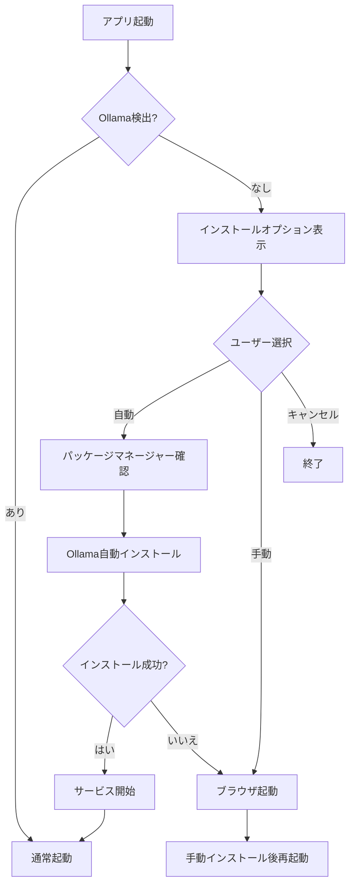

# Local LLM Chat - 自動インストール機能ガイド

## 🚀 概要

Local LLM Chatに**Ollama自動インストール機能**が追加されました！これにより、技術的な知識がないユーザーでも、ワンクリックでOllamaとNode.jsを自動インストールできます。

## ✨ 新機能

### 📱 macOS版
- **Homebrew自動インストール**: Homebrewが未インストールの場合、自動でインストール
- **Ollama自動インストール**: `brew install ollama` コマンドを自動実行
- **サービス管理**: Homebrewサービスとして適切に管理
- **ユーザーフレンドリーUI**: わかりやすいダイアログでオプション選択

### 🪟 Windows版
- **Chocolatey自動インストール**: パッケージマネージャーを自動セットアップ
- **Ollama自動インストール**: `choco install ollama` コマンドを自動実行
- **Node.js自動インストール**: 必要に応じてNode.jsも自動インストール
- **対話式インターフェース**: コマンドラインでの選択肢提示

## 🔧 使用方法

### macOS版の使用手順

1. **アプリ起動**: `Local LLM Chat.app` をダブルクリック
2. **自動検出**: システムがOllamaの存在を確認
3. **オプション選択**: 以下の3つから選択
   - **自動インストール（推奨）**: Homebrewを使用して自動インストール
   - **手動インストール**: ブラウザでダウンロードページを開く
   - **キャンセル**: 後でインストール
4. **自動実行**: 「自動インストール」選択で以下が実行される：
   ```bash
   # Homebrew のインストール（必要な場合）
   /bin/bash -c "$(curl -fsSL https://raw.githubusercontent.com/Homebrew/install/HEAD/install.sh)"
   
   # Ollama のインストール
   brew install ollama
   
   # サービス開始
   brew services start ollama
   ```
5. **完了通知**: インストール完了後、通知が表示される

### Windows版の使用手順

1. **アプリ起動**: `start-app.bat` を実行
2. **自動検出**: システムがOllamaとNode.jsの存在を確認
3. **オプション選択**: コマンドラインで1-3から選択
   - **1. 自動インストール（推奨）**: Chocolatey経由で自動インストール
   - **2. 手動ダウンロード**: ブラウザでダウンロードページを開く
   - **3. 終了**: インストールをスキップ
4. **自動実行**: 「1」選択で以下が実行される：
   ```batch
   # Chocolatey のインストール（必要な場合）
   powershell -Command "iex ((New-Object System.Net.WebClient).DownloadString('https://community.chocolatey.org/install.ps1'))"
   
   # Ollama のインストール
   choco install ollama -y
   
   # Node.js のインストール（必要な場合）
   choco install nodejs -y
   ```
5. **サービス開始**: インストール後、自動でOllamaサービスが開始

## 🔒 セキュリティ考慮事項

### 管理者権限
- **macOS**: Homebrewインストール時にパスワード入力が必要
- **Windows**: Chocolateyインストール時に管理者権限が必要

### ネットワーク接続
- インターネット接続が必要（ダウンロード用）
- 企業ネットワークの場合、プロキシ設定が必要な場合があります

### ファイアウォール
- Ollamaはローカルサーバー（ポート11434）として動作
- 必要に応じてファイアウォール設定の調整が必要

## 📊 自動インストールの流れ



## 🛠️ トラブルシューティング

### macOS

**問題**: Homebrewインストールでエラー
```bash
# 解決方法: 手動でHomebrewをインストール
/bin/bash -c "$(curl -fsSL https://raw.githubusercontent.com/Homebrew/install/HEAD/install.sh)"

# PATH設定（Apple Silicon Mac）
echo 'eval "$(/opt/homebrew/bin/brew shellenv)"' >> ~/.zprofile
eval "$(/opt/homebrew/bin/brew shellenv)"
```

**問題**: アプリケーション権限エラー
```bash
# 解決方法: quarantine属性を削除
sudo xattr -r -d com.apple.quarantine "/Applications/Local LLM Chat.app"
```

### Windows

**問題**: Chocolateyインストールでエラー
```powershell
# 解決方法: PowerShell実行ポリシーを変更
Set-ExecutionPolicy Bypass -Scope Process -Force
```

**問題**: パッケージインストールでエラー
```batch
# 解決方法: 管理者モードでコマンドプロンプトを起動
# 右クリック → "管理者として実行"
```

## 📈 利点

### ユーザー体験の向上
- ✅ **ワンクリックインストール**: 技術的知識不要
- ✅ **エラー処理**: 適切なフォールバック機能
- ✅ **進捗表示**: わかりやすい通知とログ

### 管理の簡素化
- ✅ **パッケージマネージャー活用**: 将来的なアップデートが容易
- ✅ **サービス管理**: システム統合による安定動作
- ✅ **ログ記録**: トラブルシューティング用の詳細ログ

### 配布の効率化
- ✅ **依存関係の自動解決**: 手動設定作業の削減
- ✅ **クロスプラットフォーム対応**: 統一されたインストール体験
- ✅ **企業展開**: IT管理者による一括配布が可能

## 📝 技術詳細

### インストールスクリプトの構造
```bash
# macOS版
create-installer.sh
├── auto_install_ollama()      # Ollama自動インストール関数
├── check_ollama()             # Ollama検出と選択UI
├── check_nodejs()             # Node.js検出
└── start_app()                # アプリケーション起動

# Windows版  
create-windows-installer.sh
├── :auto_install_ollama       # Ollama自動インストール
├── :auto_install_nodejs       # Node.js自動インストール
├── :check_ollama              # Ollama検出
└── :start_services            # サービス開始
```

### ログファイル
- **macOS**: `~/Library/Logs/Local-LLM-Chat/app.log`
- **Windows**: `%APPDATA%\Local-LLM-Chat\logs\app.log`

## 🔄 今後の計画

### アップデート機能
- Ollamaモデルの自動更新
- アプリケーション自体の自動更新（electron-updater）

### 企業機能
- サイレントインストールモード
- 設定ファイルによる一括設定
- Active Directory統合

---

**作成日**: 2025年6月5日  
**バージョン**: 2.0.0  
**新機能**: Ollama & Node.js 自動インストール
